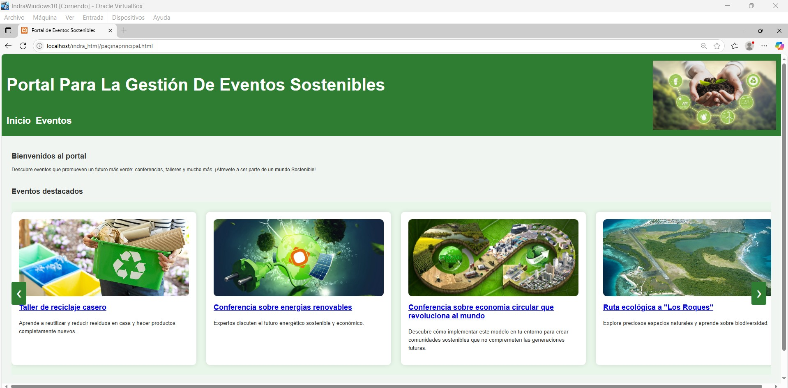
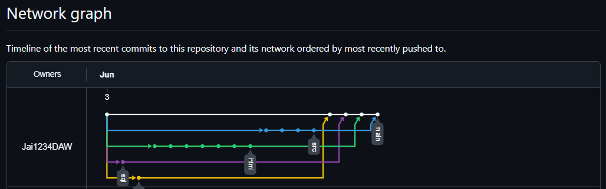

# proyectoIndraDef
Este proyecto fue propuesto por parte de MINSAIT como práctica a los alumnos de 1 Curso de DAM/DAW y consiste en el desarrollo de un portal para eventos sostenibles.

# Portal para la Gestión de Eventos Sostenibles

---

## 1. Planteamiento del Proyecto

Este proyecto consiste en el desarrollo de un **portal web** para gestionar eventos relacionados con la **sostenibilidad**, como conferencias, talleres o actividades ecológicas.

El sistema contempla:

- **Eventos** con nombre, fecha, duración, ubicación (online o presencial), categoría, organizador, etc.
- **Usuarios** que son de forma general aquellos que acceden al portal con su nombre, correo y contraseña.
- **Organizadores** que crean y gestionan eventos.
- **Participantes** que se registran y se inscriben en eventos.
- **Inscripciones** como resultado de la participación de los participantes a los eventos.
- **Categorías** para clasificar eventos y facilitar búsquedas.
- **Ubicación y Modalidad** debido a que los eventos o bien pueden ser presenciales o vía online.

> El objetivo es automatizar y centralizar toda la gestión de eventos, desde su creación hasta la inscripción y cancelación por parte de usuarios, asegurando que cada actor en este sistema cumpla el rol que le corresponde.

---

##  2. Tareas Realizadas

###    2.1 Desarrollo Web (HTML + CSS)

- Página principal con presentación y carrusel de eventos.
- Listado de eventos con tabla informativa.
- Página de detalle de cada evento con información ampliada.
- Diseño con etiquetas semánticas HTML5.
- Hojas de estilo CSS organizadas.
- Todas son Páginas estáticas.

 *Vista previa:*

---

###   2.2 Base de Datos

- Diagrama entidad-relación (ER) con 5 entidades según la nomenclatura de Piattinni vista en clases.
- Descripción sencilla del modelo Entidad-Relación para mayor comprensión. Disponible en doc. 
- Script SQL para la creación física de la base de datos.
- Descripción detallada de entidades, atributos y restricciones en las tablas.

###   2.3 Programación Java (POO)

- Desarrollo en **Java** siguiendo programación orientada a objetos.
- Se generaron 5 clases que responden al planteamiento.
- La clase inscripción se realizó con la finalidad de manejar un histórico de las inscripciones a cada evento.
- La clase Ubicación se plantea para que puedan ser a futuro realizado estos objetos. Si los eventos por ejemplo sonn realizados con frecuencia en una misma dirección.
- Se implementó el principio de herencia mediante la creación de una clase padre denominada Usuario, de la cual derivan dos clases hijas: Organizador y Participante. Esta estructura   
  responde a uno de los requerimientos fundamentales del sistema: permitir que tanto organizadores como participantes puedan identificarse dentro de la aplicación.
  Ambas clases comparten atributos comunes esenciales para la validación de los usuarios, tales como nombre de usuario, contraseña y correo electrónico. Al centralizar estos atributos en 
  una clase base, se garantiza una estructura más limpia, reutilizable y coherente en el manejo de los datos de usuario.
- Uso de listas (`ArrayList`) para gestionar colecciones.
- Separación de lógica para claridad y reutilización.

###   2.4 Sistemas Informáticos

- Instalación de **Windows 10 PRO** en una **máquina virtual**.
- Configuraciones pertinentes.
- Instalación de las Guest Additions.
- Despliegue local del portal web usando un servidor web, en este caso **XAMPP**.

###  2.5 Control de Versiones con GitHub

- Repositorio con ramas bien definidas para cada etapa del proyecto.
- Gestión del código mediante commits descriptivos.
- Integración de imágenes de evidencia.

 *Grafo de ramas Git:*

